<svg width="800" height="160" xmlns="http://www.w3.org/2000/svg">
  <defs>
    <linearGradient id="grad" x1="0%" y1="0%" x2="100%" y2="0%">
      <stop offset="0%" style="stop-color:#0d1117;stop-opacity:1" />
      <stop offset="50%" style="stop-color:#161b22;stop-opacity:1" />
      <stop offset="100%" style="stop-color:#0d1117;stop-opacity:1" />
    </linearGradient>
  </defs>
  <rect width="800" height="160" fill="url(#grad)" rx="10"/>
  <text x="400" y="75" font-family="monospace" font-size="32" font-weight="bold" fill="white" text-anchor="middle">Davi Borges</text>
  <text x="400" y="110" font-family="monospace" font-size="15" fill="#58a6ff" text-anchor="middle">Software Engineer · Backend &amp; Data Engines · Python &amp; TypeScript</text>
</svg>

---

## 👨‍💻 Sobre mim

- ⚙️ Engenheiro de Software especializado em **backend, automação de processos (RPA) e pipelines de dados em escala**
- 🏛️ Experiência com sistemas críticos de alta disponibilidade em ambientes governamentais **(INSS/DTI)** — monitoramento de infraestrutura, detecção de incidentes e automação de processos operacionais
- 🎓 Graduando em **Computação — Licenciatura pela Universidade de Brasília (UnB)**
- 🔬 Futuro pesquisador com interesse em **IA, sistemas distribuídos e engenharia de dados**
- 🧱 Apaixonado por **Clean Architecture, SOLID e TDD** aplicados a problemas reais de concorrência e integração
- 🌎 Brasília, Brasil

---

## 🔭 Atualmente

| Status | Detalhe |
| :--- | :--- |
| 🚀 Trabalhando em | Plataforma de dados linguísticos multimodais para alinhamento de LLMs (RLHF/DPO) |
| 🎓 Cursando | Computação Licenciatura — UnB |
| 📚 Estudando | Sistemas Distribuídos, Data Engineering avançado e MLOps |
| 🔬 Objetivo | Pesquisa aplicada em IA, NLP e alinhamento de modelos de linguagem |

---

## 🚀 Projetos em Destaque

### 🌐 [Mebêngôkre Data Engine & API](https://github.com/Redohairi) *(Projeto IA/RLHF)*
> Plataforma backend distribuída para coleta e revisão de dados linguísticos multimodais (Áudio/Texto), projetada para alinhar LLMs via *Direct Preference Optimization* (Intel Gaudi).

- **Concorrência:** Orquestração de micro-tarefas com `SELECT FOR UPDATE SKIP LOCKED` no PostgreSQL — zero *race conditions* com dezenas de workers simultâneos
- **Resiliência:** Rotas idempotentes + NeonDB Serverless com pooling duplo (PgBouncer/Direct) para evitar *cold starts*
- **Dados:** Pipeline ETL incremental processando **+440k sentenças** com NLTK, deduplicação via SHA256
-     

---

### 🤖 [Plataforma de Monitoramento de Infraestrutura — INSS/DTI](https://github.com/Redohairi)
> Sistema de observabilidade e detecção de incidentes para monitoramento em tempo real de agências e circuitos de rede do INSS, integrado ao Zabbix.

- **Telemetria distribuída:** Pipeline de coleta paralela consultando **+2.200 endpoints SOAP** via `multithreading`, com parsing automático de respostas XML/HTML
- **Correlação de eventos:** Lógica para detecção automática de início e fim de incidentes operacionais a partir de análise de estados (`from_state` / `to_state`)
- **ETL leve:** Ingestão → transformação → exportação de datasets estruturados (CSV) com campos como `data_Hora_Inicio`, `Evento_Inicio`, `Evento_Fim`, `ID APS`, `Nome da APS`
- **Automação de tickets:** Integração com **Redmine** para atualização automática de issues a partir dos dados coletados, incluindo campos como Designação Telebrás
- **Automação web:** Scripts com **Selenium** para interação com sistemas legados internos — login, navegação e extração de dados
- **Arquitetura:** Evolução do projeto para padrão MVC com separação de entidades e utilitários reutilizáveis
-     

---

### 🔄 [API de Enriquecimento e Normalização de Dados](https://github.com/Redohairi)
> Gateway de integração que atua como hub central para múltiplas fontes de dados externas.

- **Impacto:** Redução de inconsistências nos dados internos via validação estrita de contratos
- **Engenharia:** Integração com APIs de terceiros, serialização e normalização de *payloads* complexos com Pydantic
-   

---

## 🧰 Toolbox

**Backend & APIs**

**Frontend**

**Banco de Dados**

**Automação & Scraping**

**Observabilidade & Infra**

**QA & Boas Práticas**

---

## 📈 GitHub Analytics

  

---

  Feito com ☕ e muitas linhas de código · UnB · Brasília

